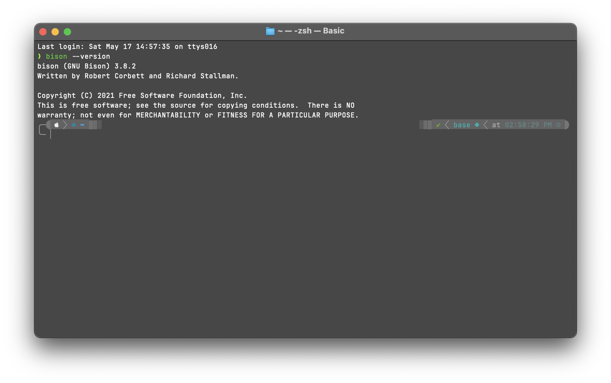
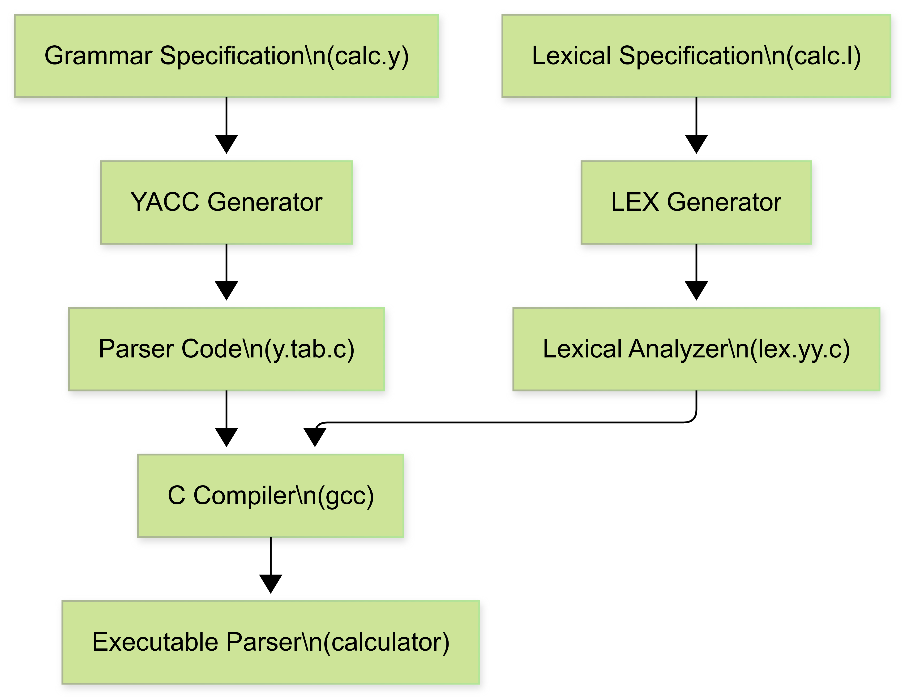
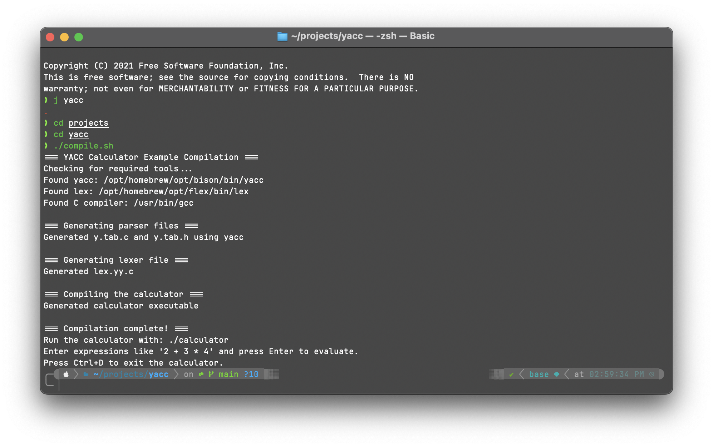
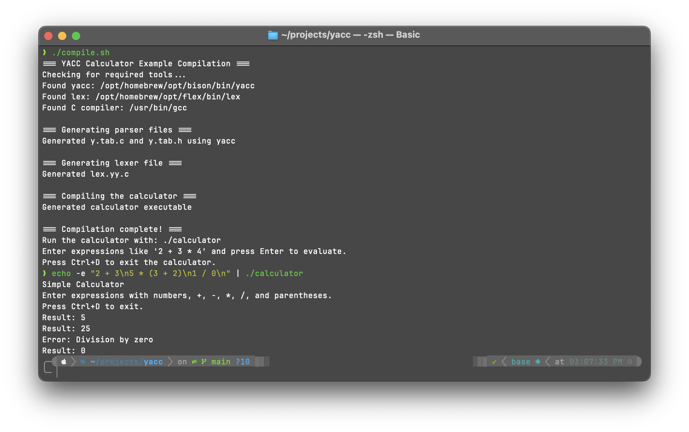
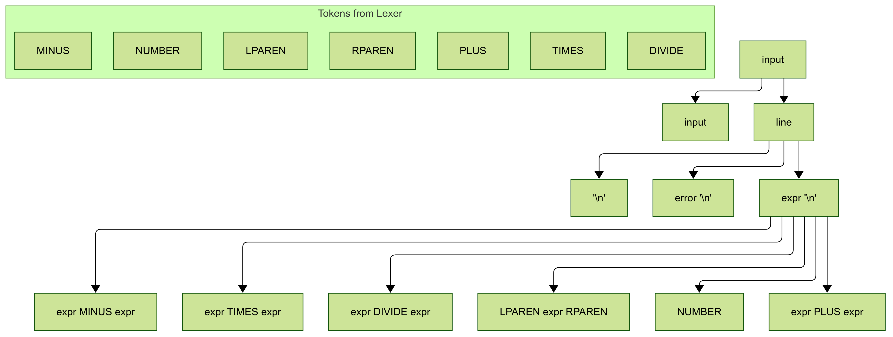
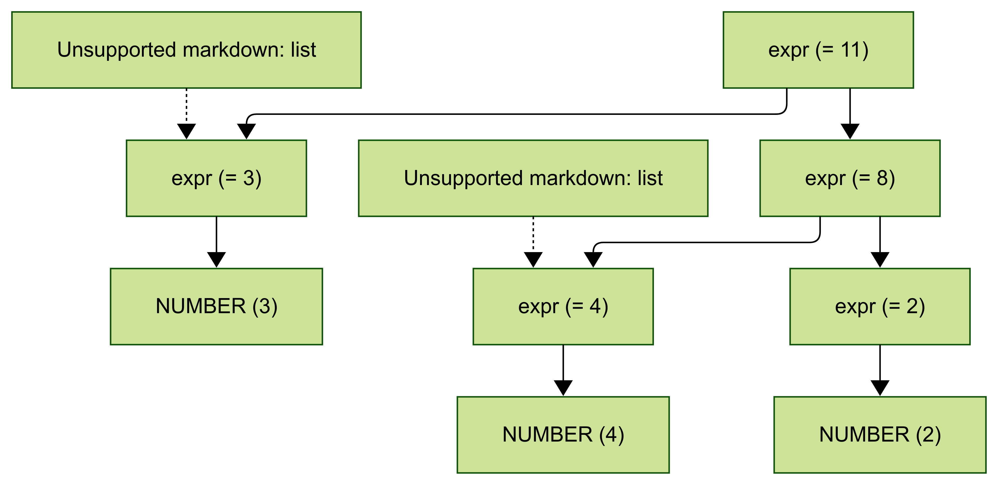

# A Comprehensive Guide to Using YACC (Yet Another Compiler Compiler)

## Introduction

YACC (Yet Another Compiler Compiler) is a powerful parser generator tool that translates context-free grammar specifications into executable parsers. It's commonly used in compiler design, interpreters, and other language processing applications. This report provides a detailed guide on how to use YACC effectively.

## Prerequisites

Before using YACC, ensure you have:

- A Unix-like operating system (Linux, macOS)
- YACC installed (commonly available as `yacc` or GNU Bison as `bison`)
- C compiler (GCC or Clang)
- Basic understanding of Context-Free Grammars (CFGs)
- LEX (for lexical analysis) is often used in conjunction with YACC

## Installation

On macOS:
```
brew install bison
```

On Ubuntu/Debian:
```
sudo apt-get install bison
```

### Installation Screenshot



## The YACC Workflow

1. Define tokens with LEX
2. Define grammar rules with YACC
3. Compile the YACC file
4. Compile the generated C code
5. Run the resulting parser

### YACC Workflow Diagram



### YACC Processing Pipeline

1. **Input Preparation**:
   - Create lexical specification (calc.l)
   - Create grammar specification (calc.y)
2. **Code Generation**:
   - LEX processes calc.l to generate lex.yy.c
   - YACC processes calc.y to generate y.tab.c and y.tab.h
3. **Compilation**:
   - C compiler compiles both generated files together
   - Links with LEX and YACC libraries (-ll and -ly)
4. **Execution**:
   - The resulting parser reads input text
   - Tokenizes the input using the lexical analyzer
   - Parses according to the grammar rules
   - Performs the semantic actions specified in the grammar

## YACC File Structure

A typical YACC file (`.y` extension) has three sections separated by `%%`:

```
/* Declarations section */
%{
#include <stdio.h>
/* C code, includes, declarations */
%}

/* Token and type declarations */
%token NUMBER
%token PLUS MINUS TIMES DIVIDE
%token LPAREN RPAREN

%%
/* Rules section - grammar rules and actions */
expr    : expr PLUS term   { $$ = $1 + $3; }
        | expr MINUS term  { $$ = $1 - $3; }
        | term             { $$ = $1; }
        ;

term    : term TIMES factor { $$ = $1 * $3; }
        | term DIVIDE factor { $$ = $1 / $3; }
        | factor           { $$ = $1; }
        ;

factor  : NUMBER          { $$ = $1; }
        | LPAREN expr RPAREN { $$ = $2; }
        ;
%%
/* Auxiliary functions section */
int main() {
    yyparse();
    return 0;
}

int yyerror(char *s) {
    fprintf(stderr, "Error: %s\n", s);
    return 0;
}
```

## Step-by-Step Guide to Using YACC

### Step 1: Create a Lexical Analyzer with LEX

Create a file named `lexer.l`:

```
%{
#include <stdio.h>
#include "y.tab.h"
%}

%%
[0-9]+      { yylval = atoi(yytext); return NUMBER; }
"+"         { return PLUS; }
"-"         { return MINUS; }
"*"         { return TIMES; }
"/"         { return DIVIDE; }
"("         { return LPAREN; }
")"         { return RPAREN; }
[ \t\n]     { /* Skip whitespace */ }
.           { printf("Unrecognized character: %s\n", yytext); }
%%

int yywrap() {
    return 1;
}
```

### Step 2: Create a YACC Grammar File

Create a file named `parser.y` with the grammar specification (similar to the example structure shown above).

### Step 3: Compile the YACC File

```
yacc -d parser.y
```

This generates:
- `y.tab.c` (the C code for the parser)
- `y.tab.h` (header file with token definitions)

The `-d` flag tells YACC to generate the header file.

### Step 4: Compile the LEX File

```
lex lexer.l
```

This generates `lex.yy.c` (the C code for the lexical analyzer).

### Step 5: Compile Everything Together

```
gcc -o parser y.tab.c lex.yy.c -ly -ll
```

Where:
- `-ly` links the YACC library
- `-ll` links the LEX library

### Step 6: Run Your Parser

```
./parser
```

## Compilation Script Explained

The provided `compile.sh` script automates the process of building the calculator example using YACC and LEX. Here's what each part of the script does:

1. **Exit on Error**
   - The script starts with `set -e`, which ensures that if any command fails, the script will stop immediately. This prevents cascading errors.

2. **Tool Detection**
   - The script checks for the presence of required tools: Bison/YACC, Flex/LEX, and GCC (the C compiler).
   - It prefers GNU Bison and Flex if available, but will fall back to the system's yacc and lex if not.
   - On macOS, it also checks for Homebrew-installed versions and uses them if present.

3. **Parser Generation**
   - The script runs YACC/Bison on `calc.y` to generate the parser source code (`y.tab.c`) and header (`y.tab.h`).
   - If the default tool fails, it tries the Homebrew version as a fallback.

4. **Lexer Generation**
   - The script runs LEX/Flex on `calc.l` to generate the lexical analyzer source code (`lex.yy.c`).
   - Again, it tries the Homebrew version if the default fails.

5. **Compilation**
   - The script compiles the generated C files (`y.tab.c` and `lex.yy.c`) into an executable named `calculator` using GCC.
   - It links with the LEX library (`-ll`). If that fails, it retries without the library flags as a fallback.

6. **Completion Message**
   - After successful compilation, the script prints instructions on how to run the calculator and what to expect.

### Why Use This Script?
- **Portability**: It works on both Linux and macOS, and adapts to different tool installations.
- **Robustness**: It checks for errors at every step and provides clear error messages.
- **Convenience**: You can build the entire project with a single command: `./compile.sh`.

**In summary:** The `compile.sh` script ensures that anyone can easily and reliably build and run the YACC calculator example, regardless of their system configuration.

## Practical Example: A Simple Calculator

Let's implement a basic calculator that can handle addition, subtraction, multiplication, and division.

### Lexer (calc.l)
```
%{
#include <stdio.h>
#include "y.tab.h"
%}

%%
[0-9]+      { yylval = atoi(yytext); return NUMBER; }
"+"         { return PLUS; }
"-"         { return MINUS; }
"*"         { return TIMES; }
"/"         { return DIVIDE; }
"("         { return LPAREN; }
")"         { return RPAREN; }
[ \t\n]     { /* Skip whitespace */ }
.           { printf("Unrecognized character: %s\n", yytext); }
%%

int yywrap() {
    return 1;
}
```

### Parser (calc.y)
```
%{
#include <stdio.h>
#include <stdlib.h>
int yylex();
void yyerror(const char *s);
%}

%token NUMBER
%token PLUS MINUS TIMES DIVIDE
%token LPAREN RPAREN
%left PLUS MINUS
%left TIMES DIVIDE

%%
input:    /* empty */
        | input line
        ;

line:     '\n'
        | expr '\n'  { printf("Result: %d\n", $1); }
        | error '\n' { yyerrok; }
        ;

expr:     NUMBER            { $$ = $1; }
        | expr PLUS expr    { $$ = $1 + $3; }
        | expr MINUS expr   { $$ = $1 - $3; }
        | expr TIMES expr   { $$ = $1 * $3; }
        | expr DIVIDE expr  { 
            if ($3 == 0) {
                yyerror("Division by zero");
                $$ = 0;
            } else {
                $$ = $1 / $3;
            }
        }
        | LPAREN expr RPAREN { $$ = $2; }
        ;
%%

void yyerror(const char *s) {
    fprintf(stderr, "Error: %s\n", s);
}

int main() {
    printf("Simple Calculator\n");
    printf("Enter expressions with numbers, +, -, *, /, and parentheses.\n");
    printf("Press Ctrl+D to exit.\n");
    yyparse();
    return 0;
}
```

### Compilation Screenshot



### Execution Screenshot



---

# Detailed Explanation of the Calculator Grammar

This section provides a line-by-line explanation of the grammar in our calculator example.

## Grammar Structure Visualization



## Declarations Section

```
%{
#include <stdio.h>
#include <stdlib.h>
int yylex();
void yyerror(const char *s);
%}
```

This section includes C code that will be copied directly to the generated parser. It includes:
- Header files for standard I/O and library functions
- Forward declaration of `yylex()` which is the lexical analyzer generated by LEX
- Forward declaration of `yyerror()` which is a function for error reporting

## Token Declarations

```
%token NUMBER
%token PLUS MINUS TIMES DIVIDE
%token LPAREN RPAREN
```

These lines declare the tokens (terminal symbols) used in our grammar:
- `NUMBER`: Represents numeric literals
- `PLUS`, `MINUS`, `TIMES`, `DIVIDE`: Represent arithmetic operators (+, -, *, /)
- `LPAREN`, `RPAREN`: Represent opening and closing parentheses

## Precedence Declarations

```
%left PLUS MINUS
%left TIMES DIVIDE
```

These lines specify the precedence and associativity of operators:
- `%left` means the operators are left-associative (e.g., 5-3-2 is interpreted as (5-3)-2)
- Operators on the same line have the same precedence
- Operators declared later have higher precedence, so TIMES and DIVIDE have higher precedence than PLUS and MINUS

## Grammar Rules

```
```

## Common YACC Directives and Features

- `%token`: Declares tokens
- `%left`, `%right`, `%nonassoc`: Specify associativity
- `%prec`: Specifies precedence for a particular rule
- `%union`: Defines data types for semantic values
- `%type`: Declares the type of non-terminals

## Error Recovery in YACC

YACC provides built-in error recovery mechanisms using the `error` token:

```
statement: error ';' { yyerrok; }
```

This rule allows the parser to recover from errors when it encounters a semicolon.

## Advanced YACC Features

### Semantic Actions
Actions are C code enclosed in braces `{}` that execute when a rule is matched.

### Symbol Values
- `$$`: The value of the left-hand side symbol
- `$1`, `$2`, etc.: Values of the right-hand side symbols

### Parameter Passing
YACC supports parameter passing between grammar rules.

## Best Practices

1. Start with a clear language specification
2. Design the grammar to be unambiguous
3. Use appropriate precedence and associativity directives
4. Implement robust error handling
5. Test thoroughly with both valid and invalid inputs
6. Document your grammar rules and actions

## Conclusion

YACC is a powerful tool for parser generation that significantly simplifies compiler development. By following the steps outlined in this report, you can create efficient parsers for various language processing applications. While it has a steep learning curve, YACC's ability to handle complex grammars makes it an essential tool for language implementers.

## References

1. Levine, J., Mason, T., & Brown, D. (1992). Lex & yacc. O'Reilly Media.
2. GNU Bison Documentation: https://www.gnu.org/software/bison/manual/
3. Aho, A. V., Lam, M. S., Sethi, R., & Ullman, J. D. (2006). Compilers: Principles, Techniques, and Tools (2nd Edition).

Given the expression `3 + 4 * 2` and our calculator grammar rules which give multiplication higher precedence than addition, the parse tree would look like:



Without precedence rules, the tree would have been evaluated left-to-right, giving:

